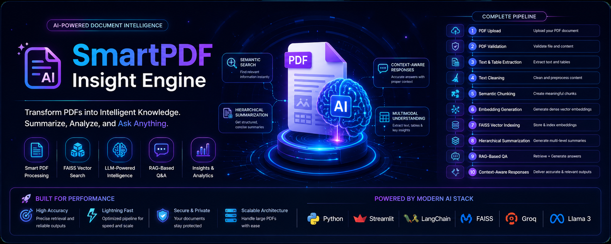
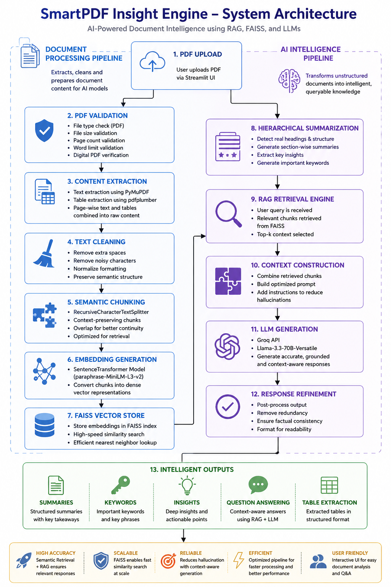
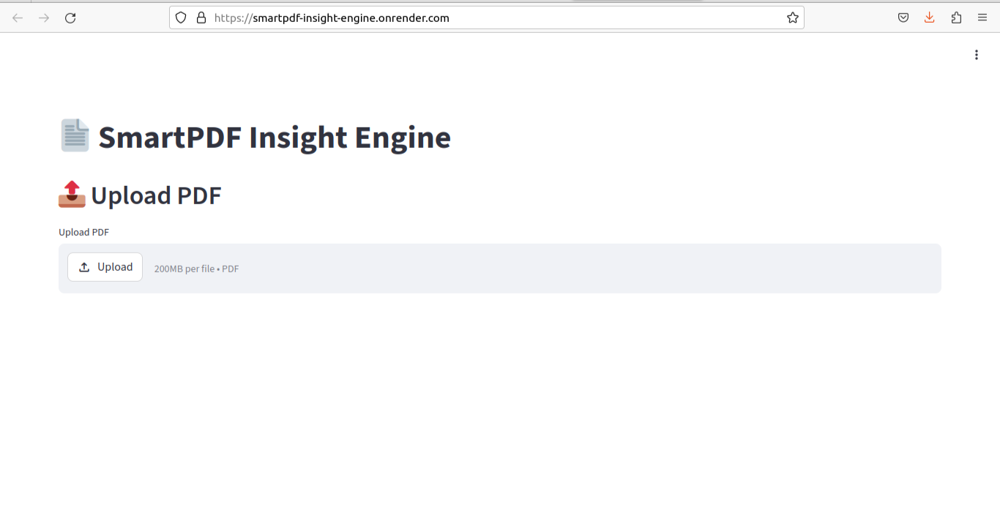
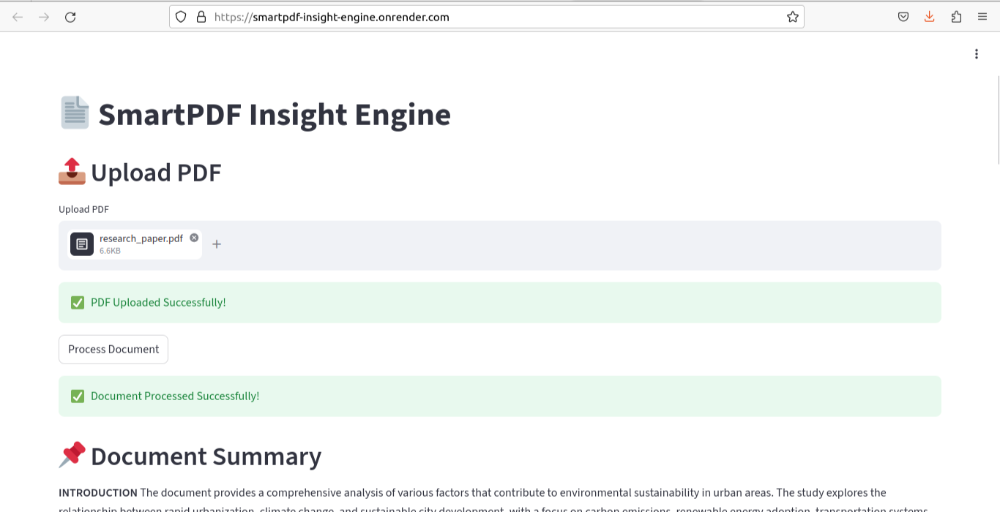
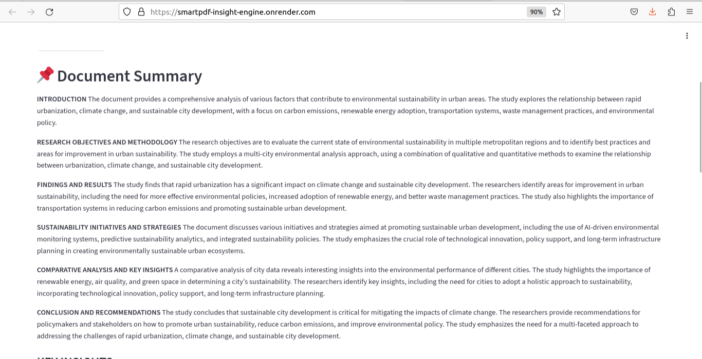
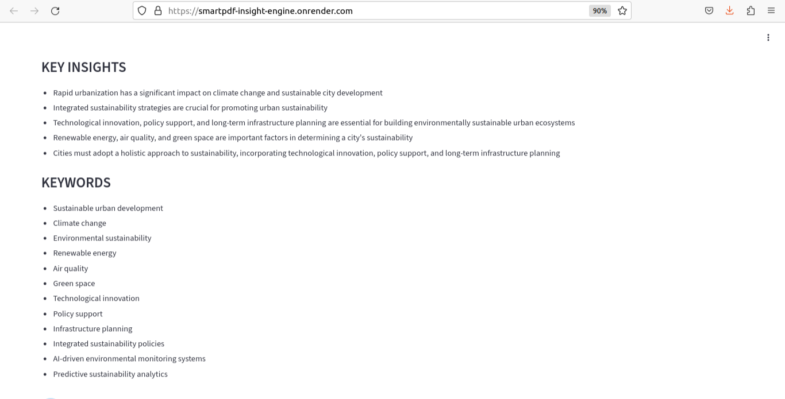
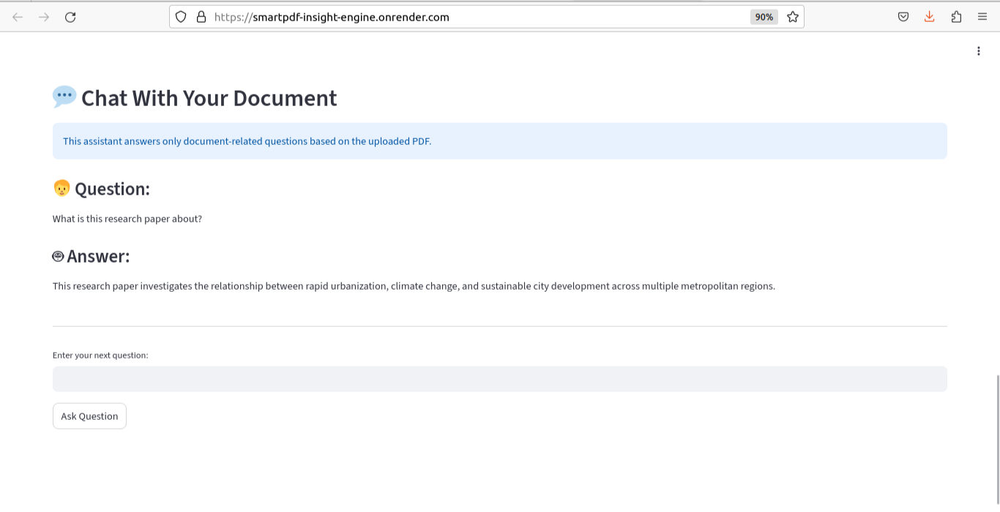

# 📄 SmartPDF Insight Engine

<p align="center">
  
</p>

<h3 align="center">
Advanced AI-Powered Document Intelligence System using Semantic Retrieval, FAISS Vector Search, Hierarchical Summarization, and Retrieval-Augmented Generation (RAG)
</h3>

---

<p align="center">


</p>

---

# 🚀 Overview

SmartPDF Insight Engine is an advanced AI-powered document understanding system designed to intelligently process, summarize, retrieve, and answer questions from PDF documents using modern NLP and Retrieval-Augmented Generation (RAG) techniques.

The system combines:

- 📑 PDF Extraction
- 🧠 Semantic Chunking
- 🔍 FAISS Vector Retrieval
- 🤖 LLM-Powered Summarization
- 💬 Context-Aware Question Answering
- 📚 Retrieval-Augmented Generation (RAG)

to transform traditional PDFs into intelligent interactive knowledge systems.

---

# 🎯 Problem Statement

Traditional PDF readers struggle to provide intelligent understanding of large and complex documents.

Users often face:

- Time-consuming manual reading
- Difficulty extracting insights
- Poor semantic search
- Lack of contextual question answering
- Inefficient navigation through lengthy PDFs

SmartPDF Insight Engine solves these challenges using AI-powered document intelligence pipelines.

---

# ✨ Key Features

## 📄 Intelligent PDF Processing
- Validates uploaded PDF documents
- Handles page limits and word constraints
- Detects unsupported/scanned PDFs

## 🧹 Advanced Text Cleaning
- Removes noisy formatting
- Normalizes spacing and structure
- Preserves document readability

## ✂️ Semantic Chunking
- Recursive semantic text splitting
- Context-preserving chunk overlap
- Optimized for retrieval accuracy

## 🧠 Embedding Generation
- SentenceTransformer embeddings
- Semantic vector representation
- Efficient batch embedding pipeline

## 🔍 FAISS Vector Database
- High-speed similarity search
- Semantic document retrieval
- Efficient vector indexing

## 📌 Hierarchical AI Summarization
- Structured heading-aware summaries
- Key insights extraction
- Intelligent keyword generation

## 💬 RAG-based Question Answering
- Context-aware answer generation
- Retrieves relevant document chunks
- Prevents hallucinated responses

## 🌐 Interactive Streamlit Interface
- PDF upload interface
- Real-time summarization
- Conversational document chat system

---

# 🏗️ System Architecture

## Complete Pipeline Workflow

<p align="center">
  
</p>

---

# 🧠 AI Pipeline Explanation

## 1️⃣ PDF Validation
The uploaded document is validated using:
- File extension checking
- File size constraints
- Page count validation
- Word limit validation
- Digital PDF verification

---

## 2️⃣ Content Extraction
The system extracts:
- Page-wise text using PyMuPDF
- Structured tables using pdfplumber

The extracted content is then merged into a unified document structure.

---

## 3️⃣ Text Cleaning
The preprocessing pipeline:
- Removes unnecessary spaces
- Cleans invisible characters
- Normalizes paragraph formatting
- Preserves semantic readability

---

## 4️⃣ Semantic Chunking
The cleaned text is split using:

`RecursiveCharacterTextSplitter`

Features:
- Context-preserving overlap
- Semantic splitting strategy
- Retrieval-optimized chunk structure

---

## 5️⃣ Embedding Generation
Document chunks are converted into semantic vectors using:

`sentence-transformers/paraphrase-MiniLM-L3-v2`

This enables semantic similarity search.

---

## 6️⃣ FAISS Vector Search
The generated embeddings are stored in a FAISS vector database for:
- Fast retrieval
- Semantic search
- Efficient nearest-neighbor lookup

---

## 7️⃣ Hierarchical Summarization
The summarization engine:
- Detects real headings/subheadings
- Preserves document hierarchy
- Extracts key insights
- Generates structured summaries

Powered using:
- Groq LLM API
- Llama-3.3-70B-Versatile

---

## 8️⃣ Retrieval-Augmented Generation (RAG)
When a user asks a question:
1. Relevant chunks are retrieved
2. Context is constructed
3. LLM generates grounded answers
4. Hallucinations are minimized

---

# 🛠️ Tech Stack

| Category | Technologies Used |
|---|---|
| Frontend | Streamlit |
| Language | Python |
| PDF Processing | PyMuPDF, pdfplumber |
| NLP | NLTK |
| Semantic Chunking | LangChain Text Splitters |
| Embeddings | SentenceTransformers |
| Embedding Model | paraphrase-MiniLM-L3-v2 |
| Vector Database | FAISS |
| LLM Provider | Groq |
| LLM Model | Llama-3.3-70B-Versatile |
| Machine Learning | Scikit-learn |
| Deployment | Render |

---

# 📂 Project Structure

```bash
SmartPDF_Insight_Engine/
│
├── app.py
├── main.py
├── config.py
├── requirements.txt
├── LICENSE
├── .gitignore
│
├── assets/
│   ├── architecture.png
│   ├── banner.png
│   └── screenshots/
│       ├── upload_ui.png
│       ├── summary_output.png
│       └── qa_output.png
│
└── utils/
    ├── validator.py
    ├── pdf_extractor.py
    ├── cleaner.py
    ├── chunker.py
    ├── embedding_generator.py
    ├── faiss_manager.py
    ├── summarizer.py
    ├── retriever.py
    └── rag_engine.py
```

---

# 📸 Application Screenshots

---

## 1️⃣ Interface (Before Upload)

<p align="center">
  
</p>

---

## 2️⃣ PDF Uploaded

<p align="center">
  
</p>

---

## 3️⃣ AI Summary Output

<p align="center">
  
</p>

---

## 4️⃣ Keywords & Insights

<p align="center">
  
</p>

---

## 5️⃣ Chat / RAG Question Answering

<p align="center">
  
</p>

---

# ⚙️ Installation

## Clone Repository

```bash
git clone https://github.com/sivakavihemalatha-hub/SmartPDF_Insight_Engine.git
```

---

## Move into Project Directory

```bash
cd SmartPDF_Insight_Engine
```

---

## Install Dependencies

```bash
pip install -r requirements.txt
```

---

## Run Application

```bash
streamlit run app.py
```

---

# 🌐 Deployment

The project is deployed using:
- Render
- Streamlit Framework

## Live Demo

[Open SmartPDF Insight Engine](https://smartpdf-insight-engine.onrender.com)

---

# 📈 Future Improvements

- Multi-document analysis
- OCR support for scanned handwritten PDFs
- Hybrid retrieval pipelines
- Knowledge graph integration
- Citation-aware responses
- Agentic AI workflows
- Multi-language document understanding
- Cloud vector database support

---

# 👩‍💻 Author

## Hemalatha Sivakavi

AI/ML Enthusiast | Generative AI Developer | Document Intelligence Systems

---

# 📜 License

This project is licensed under the MIT License.

---

# ⭐ Support

If you found this project useful, consider giving it a ⭐ on GitHub.
